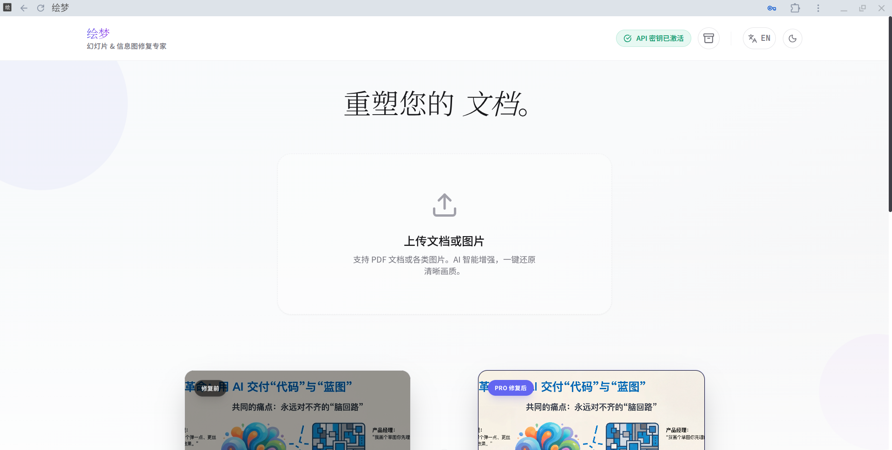
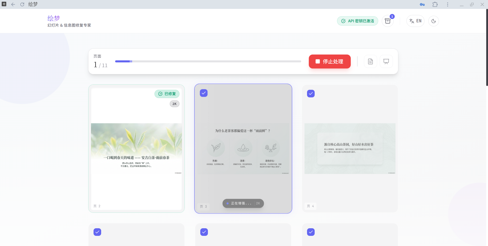

[ English ](./README-EN.md) | [ 简体中文 ](./README.md)
 
# 绘梦 (Huimeng)
 
 
 [](https://opensource.org/licenses/MIT)
 
 
 
**绘梦** 是一款专为修复 [NotebookLM](https://notebooklm.google.com/) 生成的 PDF 文档、图片（如信息图等）而设计的智能工具。它利用最新一代 **Gemini** 多模态模型，解决文档中常见的文字模糊、伪影和分辨率过低问题，实现像素级的画质重塑，并支持导出为高清晰度的 PDF 或 PPTX 演示文稿。




### 📊 修复效果对比 (Before & After)

| 🔴 修复前 (Original) | 🟢 修复后 (Restored) |
| :---: | :---: |
|  |  |


## ✨ 核心特性

> **🚀 v2.2.3 提示词增强 (Prompt Refined)**
> - **文字精准度大幅提升**: 深度优化了底层提示词逻辑。现在 AI 会结合"段落、句子、词组"的上下文语境来推断模糊文字，大幅减少幻觉与错别字。
> - **布局更严谨**: 强化了对"原图构图、色彩分布、UI布局"的约束指令，确保修复后的图片与原图在视觉上高度一致，不再出现结构性重构。
>
> **🔥 v2.2.1 更新日志 (Hotfix)**
> - **Cloudflare R2 混合加速**: 自动识别超大图片并启用 R2 中转，完美突破 Vercel 4.5MB 响应限制。4K 大图生成成功率提升至 99.9%！
>
> **🚀 New in v2.2**
> - **📦 本地档案盒 (Local Archive Box)**: 自动保存您生成的高清原图。即使刷新页面，历史生成记录也不会丢失。数据存储在本地，隐私安全。
>
> **🔥 New in v2.1**
> - **图片模式 (Image Mode)**: 支持上传单张或多张图片 (PNG/JPG/WEBP)，不仅仅是 PDF。
> - **按需处理**: 支持勾选特定页面进行修复，节省额度。

- **🖼️ 智能超清重绘**: 基于 **Gemini** 模型，智能识别并重绘文档内容，非单纯滤镜增强。

- **🔍 像素级修复**: 提供 **2K (标准)** 与 **4K (极致)** 两种分辨率选项，满足不同场景需求。
- **📝 文字精准还原**: 修复文字边缘锯齿与模糊，同时保持原有排版布局不变（*注：仅修复画质，不篡改内容*）。
- **📊 多格式导出**:
  - **PDF**: 重新生成的清晰文档。
  - **PPTX**: 亦可导出PPTX格式，注意该格式的文件依然不支持编辑内容。
  - **ZIP**: (图片模式) 一键打包下载所有高清图片。
- **🌗 现代化交互体验**:
  - 支持 **深色/浅色模式** 切换。
  - 支持 **中/英双语** 界面。
  - **实时对比**: 长按或点击即可查看修复前后的画质差异 (支持 Lightbox 缩放)。
  - **鼠标跟随动效**: 沉浸式的视觉体验。


## 🚀 立即使用 (Online Usage)
 
无需安装，点击下方链接即可直接使用：
 
**👉 [点击打开: huimeng.zeabur.app](https://huimeng.zeabur.app/)**
 
 ### 🔑 配置 API Key
首次打开时，点击右上角的 **"配置 API"** 按钮：
- 输入您的 Google Gemini API Key (需魔法，支持 2K/4K)。
> **隐私承诺**: API Key 仅保存在浏览器本地，绝不会上传。
 
---
 
## 🛠️ 本地开发 (Developers Only)
如果您是开发者，希望在本地运行或修改代码：
 
### 1. 克隆与安装
 ```bash
 git clone https://github.com/your-username/huimeng.git
 cd huimeng
 npm install
 npm run dev
 ```
 
 ### 2. 或者一键部署您自己的版本
 [](https://vercel.com/new/clone?repository-url=https%3A%2F%2Fgithub.com%2Fyour-username%2Fhuimeng)


## 📖 使用指南


1.  **上传**: 将 NotebookLM 生成的 PDF 或图片（如信息图等）文件拖入上传区域。
2.  **预览**: 应用会自动提取 PDF 页面或图片。
3.  **配置**: 
    - 选择画质 (2K/4K)。
    - 确认 API Key 状态。
4.  **修复**: 点击 "开始增强 (Start Restoration)"。
5.  **导出**: 修复完成后，点击底部的 PDF 或 PPTX 按钮下载文件。

## 🛠️ 技术栈

本项目基于现代 Web 技术构建：

- **App Framework**: [React 19](https://react.dev/) + [Vite](https://vitejs.dev/)
- **Language**: TypeScript
- **Styling**: Tailwind CSS
- **AI Integration**: [Google GenAI SDK](https://www.npmjs.com/package/@google/genai) (Gemini)
- **PDF Core**: [PDF.js](https://mozilla.github.io/pdf.js/) (Rendering) & [jsPDF](https://github.com/parallax/jsPDF) (Export)
- **Presentation**: [PptxGenJS](https://gitbrent.github.io/PptxGenJS/)

## ⚠️ 免责声明

> **请在使用前仔细阅读**

1.  **AI 修复局限性**: 本工具使用生成式 AI (GenAI) 进行画质重绘。虽然效果显著，但**并非 100% 完美**。对于原图中**极小、极其模糊或辨识度极低**的文字，AI 可能会出现无法识别、修复失败或"幻觉"（即猜测错误）的情况。请用户予以理解。

## 🤝 贡献

欢迎提交 Issue 和 Pull Request！

## 📄 许可证

本项目采用 [MIT 许可证](LICENSE)。
